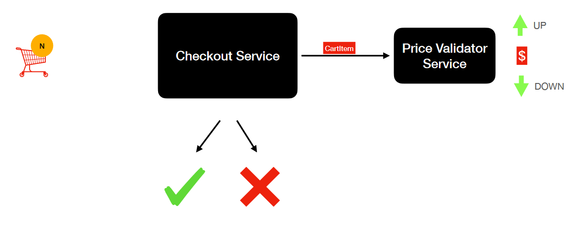
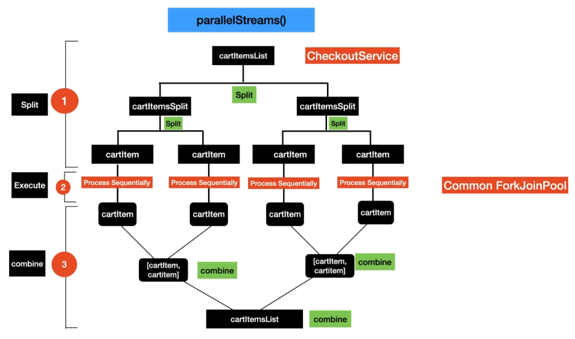
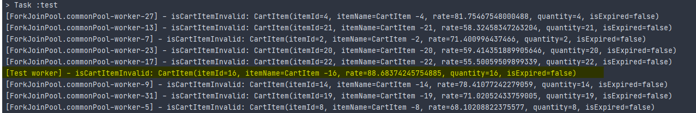
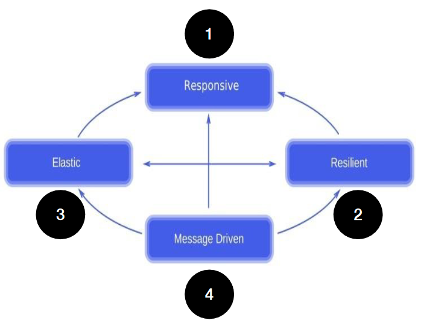
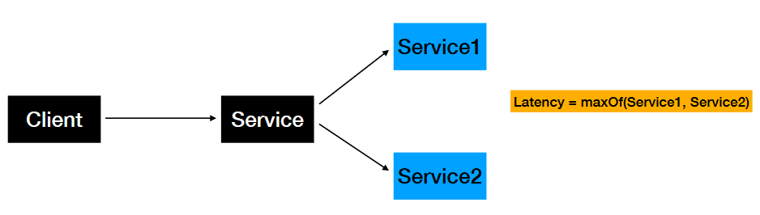
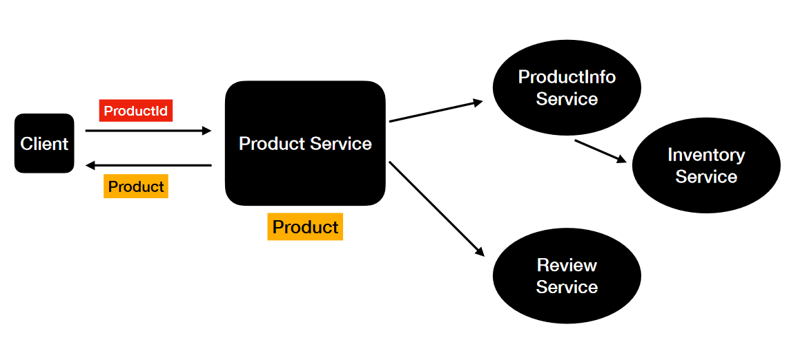
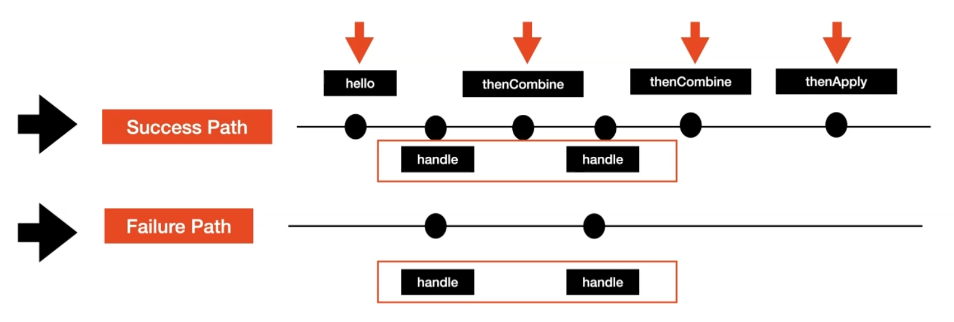
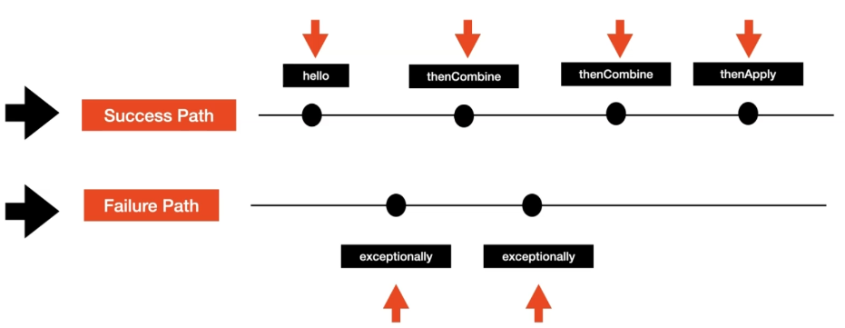
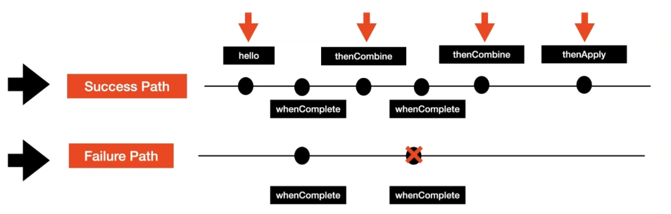
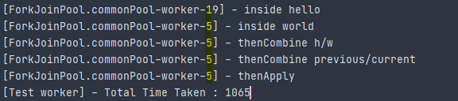

+# Multithreading,Parallel & Asynchronous Coding in Modern Java
This repo has the code for parallel and asynchronous programming in Java.

# What is parallelism (vs. Concurrency) 


```java
public class ParallelismExample {
    public static void main(String[] args) {
        List<String> namesList = List.of("Bob", "Jamie", "Jill", "Rick");
        System.out.println("namesList : " + namesList);
        List<String> namesListUpperCase = namesList
                .parallelStream()
                .map(String::toUpperCase)
                .collect(Collectors.toList());

        System.out.println("namesListUpperCase : " + namesListUpperCase);
    }
}
```
# Threads, Future, ForkJoin and its Limitations


## Threads and its Limitations - Hands On

We need a lot of boilerplate code to achive parallelism here. We have to always implement the `Runnable` interface and pass its instances each into a seperate `Thread`.
```java
...

public Product retrieveProductDetails(String productId) throws InterruptedException {
    stopWatch.start();

    ProductInfoRunnable productInfoRunnable = new ProductInfoRunnable(productId);
    Thread productInfoThread = new Thread(productInfoRunnable);

    ReviewRunnable reviewRunnable = new ReviewRunnable(productId);
    Thread reviewThread = new Thread(reviewRunnable);

    productInfoThread.start();
    reviewThread.start();

    productInfoThread.join();
    reviewThread.join();

    ProductInfo productInfo = productInfoRunnable.getProductInfo();
    Review review = reviewRunnable.getReview();

    stopWatch.stop();
    log("Total Time Taken : "+ stopWatch.getTime());
    return new Product(productId, productInfo, review);
}

...

private class ProductInfoRunnable implements Runnable {
    private ProductInfo productInfo;
    private String productId;

    public ProductInfoRunnable(String productId) {
        this.productId = productId;
    }

    @Override
    public void run() {
        productInfo = productInfoService.retrieveProductInfo(productId);
    }

    public ProductInfo getProductInfo() {
        return productInfo;
    }
}

private class ReviewRunnable implements Runnable {
    private String productId;
    private Review review;

    public ReviewRunnable(String productId) {
        this.productId = productId;
    }

    @Override
    public void run() {
        review = reviewService.retrieveReviews(productId);
    }

    public Review getReview() {
        return review;
    }
}

...
```
Then it's needed to manually:
- create the threads
- start the threads
- join the threads

Next thing is, threads are expensive
- threads have their own *runtime-stack*, *memory*, *registers* and ...

the answer...

## Introduction to ThreadPool/ExecutorService & Future
### ThreadPool
- Thread Pool is a group of threads created and readily available
- CPU Intensive Tasks
    - ThreadPool Size = No of Cores
- I/O task
    - ThreadPool Size > No of Cores
- What are the benefits of thread pool?
    - No need to manually create, start and join the threads
    - Achieving Concurrency in your application

### ExecutorService
- Released as part of Java5
- ExecutorService in Java is an ***Asynchronous Task Execution Engine***
- It provides a way to asynchronously execute tasks and provides the results in a much simpler way compared to threads
- This enabled *coarse-grained task based parallelism* in Java


```java
ExecutorService executorService = Executors.newFixedThreadPool(Runtime.getRuntime().availableProcessors());
```
With the use of ExecutorService and Futures we can reduce boiler plate dramatically
```java
Future<ProductInfo> productInfoFuture = executorService.submit(() -> productInfoService.retrieveProductInfo(productId));
Future<Review> reviewFuture = executorService.submit(() -> reviewService.retrieveReviews(productId));

ProductInfo productInfo = productInfoFuture.get();
Review review = reviewFuture.get();
```
Execution can even be time boxed:
```java
ProductInfo productInfo = productInfoFuture.get(1, TimeUnit.SECONDS);
```
***
ExecutorService must be shut down!
***
drawbacks:
- **Future** is designed to lead to blocking (get)

## Fork-Join Framework
- This got introduced as part of Java7
- This is an extension of **ExecutorService**
- Fork/Join framework is designed to achieve ***Data Parallelism***
- ExecutorService is designed to achieve ***Task Based Parallelism***

### Fork Join Pool

At first T1 is getting the task and splits it into subtasks.
With **Workstealing** every thread in the work queue is looking to 'steal' tasks from other tasks so that the amount of work is spread almost equally.

### Fork Join Task


- ForkJoin Task represents part of the data and its computation
- Type of tasks to submit to ForkJoin Pool
    - ForkJoinTask
        - RecursiveTask -> Task that returns a value
        - RecursiveAction -> Task that does not return a value

### ForkJoin - Use Case


**drawbacks**: code might become relatively complex.

# Getting started with Parallel Streams
Streams in general:  


To work with parallel streams we just replace the `stream` call with `parallelStream` and thats it!1!!
but wait... let's get closer...

- Streams API are sequential by default
    - sequential() -> Executes the stream in sequential
    - parallel() -> Executes the stream in parallel
    - Both the functions() changes the behavior of the whole pipeline

changing the `parallelStream()` behaviour to sequential:
```java
List<String> stringTransform(List<String> inputs) {
    return inputs.parallelStream()
            .map(ParallelStreamsExample::addNameLengthTransform)
            .sequential()
            .collect(Collectors.toList());
}
```
the other way around:
```java
List<String> stringTransform(List<String> inputs) {
    return inputs.stream()
            .map(ParallelStreamsExample::addNameLengthTransform)
            .parallel()
            .collect(Collectors.toList());
}
```
# Build Retail Checkout Application using Parallel Streams
Application overview:


- invoke price validator service for every card
- success when all items match with current pricing

# Parallel Streams - Under the hood

3 phases
- split into chunks
- execute on chunks
- combine chunks

## split
- Data Source is split in to small data chunks
    - Example - **List Collection** split into chunks of elements to size 1
- This is done using `Spliterator`s 
- For `ArrayList`, the `Spliterator` is `ArrayListSpliterator`

## execute
- Data chunks are applied to the Stream Pipeline and the **Intermediate** operations executed in a **Common ForkJoin Pool**
- Watch the **Fork/Join FrameWork** Lectures

## combine
- Combine the executed results into a final result
- Combine phase in Streams API maps to ***terminal*** operations
- Uses `collect()` and `reduce()` functions 
    - `collect(toList())`



## Comparing Spliterator Performances - ArrayList vs LinkedList
By the examples it can be seen, that the LinkedList approach isn't as performant as expected. 
- Invoking `parallelStream()` does not guarantee faster performance of your code.
    - there are additional steps needed compared to simple sequential execution

***
Always test performance improvements.
***

## Parallel Streams - Final Computation Result Order
- The order of the collection depends on:
  - Type of Collection
  - Spliterator Implementation of the collection
- Example : ArrayList
  - Type of Collection - ***Ordered***
  - Spliterator Implementation - Ordered Spliterator Implementation
- Example : Set
  - Type of Collection - ***UnOrdered***
  - Spliterator Implementation - UnOrdered Spliterator Implementation
***
Order is only maintained for ordered collections.
***
## Collect & Reduce Terminal Operation in Parallel Streams

| Collect                                               | Reduce                                          |
|-------------------------------------------------------|-------------------------------------------------|
| - Part of Streams API                                 | - Part of Streams API                           |
| - Used as a terminal operation in Streams API         | - Used as a terminal operation in Streams API   |
| - Produces a single result                            | - Produces a single result                      |
| - Result is produced in a **mutable fashion**         | - Result is produced in a **immutable fashion** |
|                                                       | - Reduce the computation into a **single value**|
| - Feature rich and used for many different use cases  | - Sum, Multiplication                           |
| **Examples**:                                         | **Examples:**                                   |
| ```collect(toList())```, ```collect(toSet())```       | ```Sum -> reduce(0.0, (x , y)->x+y)```          |
| ```collect(summingDouble(Double::doubleValue));```    | ```Multiply -> reduce(1.0, (x , y)->x * y)```   |

## Identity in reduce() Operator
```java
public static int reduceParallel() {
    int sum = List.of(1, 2, 3, 4, 5, 6, 7, 8)
    .parallelStream()
    .reduce(0, (x, y) -> x + y);

    return sum;
}
``` 
Identityvalues for different kinds of calculations:
- Addition: **0**
    - **0** + 20 = 20
- Multiplication: **1**
    - **1** * 20 = 20
- when working with parallel streams the outcome is changed dramatically when using a wrong identity because of the chunking of partial calculations. In the above example it will show:
```java
    ...
    .reduce(1, (x, y) -> x + y);
```
Sum then is 44 instead of 37 (when used sequential stream; correct result should be however 36).

***
Reduce is recommended for computations that are associative.
***

## Streams API Operators - Poor Performance
Stream Operations that perform poor
- Sorting
- stream API operators: `iterate()`, `limit()`
- Impact of Boxing and UnBoxing when it comes to parallel Streams
  - Boxing -> Converting a Primitive Type to Wrapper class equivalent
    - 1 -> new Integer(1)
  - UnBoxing -> Converting a Wrapper class to Primitive equivalent
    - new Integer(1) -> 1

# Parallel Streams - Threading Model & Common ForkJoin Pool
Common ForkJoin Pool is used by:
- ParallelStreams
- CompletableFuture
- Completable Future have options to use a User-defined ThreadPools
- Common ForkJoin Pool is shared by the whole process

Get fork join pool parallelism:
```java
System.out.println("parallelism: " + ForkJoinPool.getCommonPoolParallelism());
```
On my machine with 12 virtual cores this results to 11... what is going on with the 12th? Just check the now enhaced test output executing CheckoutServiceTest#shouldExseed500milliesWith25elems:



It's the thread that started the pool. But this can even be changed via:
```java
System.setProperty("java.util.concurrent.ForkJoinPool.common.parallelism", "100");
```
or env passing
```
-Djava.util.concurrent.ForkJoinPool.common.parallelism=100
```  
to use every possible thread.

This is shown in the `com.learnjava.service.CheckoutServiceTest#shouldModifyParallelism` test method. In this method every item runs in it's own thread. This is practical here and reduces the overall amount of used time because we don't do heavy lifting in our threads (basically waiting). If we had the opposite situation it would be recommended to not use more threads than virtual cores.

# CompletableFuture
- Introduced in Java 8 
- CompletableFuture is an Asynchronous Reactive Functional Programming API
- Asynchronous Computations in a functional Style
- CompletableFutures API is created to solve the limitations of Future API

## Reactive API Qualities
  
**Responsive:**
- Fundamentally ***Asynchronous***
- ***Call returns immediately*** and the response will be sent when its available   

**Resilient:**
- Exception or error ***won’t crash the app*** or code   

**Elastic:**
- Asynchronous Computations normally run in a ***pool of threads***
- ***Number of of threads can go up or down*** based on the need  

**Message Driven:**
- Asynchronous computations interact with each through messages in a ***event-driven style***

## CompletableFuture API
- **Factory Methods**
  - Initiate asynchronous computation
- **Completion Stage Methods**
  - Chain asynchronous computation
- **Exception Methods** 
  - Handle Exceptions in an Asynchronous Computation

## Exploring CompletableFuture Functions
`supplyAsync()` 
- FactoryMethod
- Initiate Asynchronous computation
- Input is Supplier Functional Interface
- Returns CompletableFuture<T>()

`thenAccept()` 
- CompletionStage Method
- Chain Asynchronous Computation
- Input is Consumer Functional Interface
- Consumes the result of the previous 
- Returns CompletableFuture<Void>
- Use it at the end of the Asynchronous computation

### Hello World
```java
HelloWorldService helloWorldService = new HelloWorldService();
CompletableFuture.supplyAsync(helloWorldService::helloWorld)
        .thenAccept(x -> log("Result: " + x));
log("done!");
```
If run in main method there is nothing more seen than 'done!'. This is the case bacause the helloWorld method takes at least 1000 ms and at that point the main process is already completed.
First thing todo is simply wait...
```java
...
CommonUtil.delay(2000);
```
or even better use `join`:
```java
...
CompletableFuture.supplyAsync(helloWorldService::helloWorld)
        .thenAccept(x -> log("Result: " + x))
        .join();
...
```
***
Keep in mind that `join` is a blocking call.
***
### Transform Data using "thenApply()"
- Completion Stage method
- Transform the data from one form to another
- Input is Function Functional Interface
- Returns CompletableFuture<T>

### Unit Testing CompletableFuture using JUnit5
Check the value via:
```java
        helloFuture
                .thenAccept(s -> assertEquals("HELLO WORLD", s))
                .join();
```
*** 
Watch out for the `join` here! Without it the test would pass even if the results don't match (they are simply compared after test execution).
***
### Combining independent Async Tasks
`thenCombine()`
- This is a Completion Stage Method
- Used to Combine Independent Completable Futures
- Takes two arguments 
  - CompletionStage , BiFunction
- Returns a `CompletableFuture<T>`



`thenCompose()`
- Completion Stage method
- Transform the data from one form to another
- Input is **Function** Functional Interface
- Deals with functions that return CompletableFuture
- thenApply deals with Function that returns a value
- Returns `CompletableFuture<T>`
- **dependent task** completion depends on result of previous task

# Combining Streams and CompletableFuture

now the product info service depends on the inventory service. 

Problem with first approach - blocking call is eating performance.
```java
public Inventory addInventory(ProductOption productOption) {
    delay(500);
    return Inventory.builder()
            .count(2).build();

}
```
Is executed within more than 3000ms. Second approach introduces blocking code only when the results are collected
```java
private List<ProductOption> updateInventoryParallelCallsBlockingOnCollectResult(ProductInfo productInfo) {
    List<CompletableFuture<ProductOption>> options = productInfo.getProductOptions().stream()
            .map(option -> {
                return CompletableFuture.supplyAsync(() -> inventoryService.addInventory(option))
                        .thenApply(inventory -> {
                            option.setInventory(inventory);
                            return option;
                        });
            })
            .collect(Collectors.toList());

    return options.stream().map(CompletableFuture::join).collect(Collectors.toList());
}
```
this approach takes 1500ms+.

# Exception Handling/Recovery in CompletableFuture
- CompletableFuture is a ***functional style*** API
```java
public String helloWorldAsyncCalls() {
    CompletableFuture<String> hello = CompletableFuture.supplyAsync(() -> this.hws.hello());
    CompletableFuture<String> world = CompletableFuture.supplyAsync(() -> this.hws.world());
    CompletableFuture<String> hiCompletableFuture = CompletableFuture.supplyAsync(() -> {
        delay(1000);
        return "Hi CompletableFuture!";
    });

    String hw = hello
            .thenCombine(world, (h, w) -> h + w)
            .thenCombine(hiCompletableFuture, (prev, cur) -> prev + cur)
            .thenApply(String::toUpperCase)
            .join();

    return hw;
}
```
Let's have it try/catched:
```java
public String helloWorldAsyncCalls() {
    try {
        CompletableFuture<String> hello = CompletableFuture.supplyAsync(() -> this.hws.hello());
        CompletableFuture<String> world = CompletableFuture.supplyAsync(() -> this.hws.world());
        CompletableFuture<String> hiCompletableFuture = CompletableFuture.supplyAsync(() -> {
            delay(1000);
            return "Hi CompletableFuture!";
        });

        String hw = hello
                .thenCombine(world, (h, w) -> h + w)
                .thenCombine(hiCompletableFuture, (prev, cur) -> prev + cur)
                .thenApply(String::toUpperCase)
                .join();

        return hw;
    } catch (Exception e) {
        log("Exception is " + e);
        throw e;
    }
}
```
CompletableFuture API has functional style of handling exceptions
Three options available:
- Catch Exception and Recover
  - handle()
  - exceptionally()
- Catch Exception and Does not Recover
  - whenComplete()

## Handle/Recover Exceptions using "handle" function

The third test method produces an exception:
```
[ForkJoinPool.commonPool-worker-5] - inside world
[ForkJoinPool.commonPool-worker-19] - inside hello
[ForkJoinPool.commonPool-worker-19] - Exception after world is: java.lang.NullPointerException
```
But how? The handle function is called anyway, even if no exception occured. Then the result parameter can be used.


## Handle/Recover Exceptions using "exceptionally" function


## Handling Exceptions using "whenComplete" function
Catches the Exception but does not recover from it.


# CompletableFuture & Threadpool
By default, `CompletableFuture` uses the Common `ForkJoinPool`. The no of threads in the pool == number of cores. 

## Why use a different ThreadPool?
- Common ForkJoinPool is shared by
  - ParallelStreams
  - CompletableFuture
- Its common for applications to use ParallelStreams and CompletableFuture together
  - The following issues may occur:
    - Thread being blocked by a time consuming task
    - Thread not available

Creating a User-defined ThreadPool:
```java
Executors.newFixedThreadPool(Runtime.getRuntime().availableProcessors());
```
# Threads and Async Overloaded Methods in CompletableFuture
**Motivation**: See `com.learnjava.completablefuture.CompletableFutureHelloWorld.helloWorldCombined3AsyncTasksWithLog`.   
**Test Output**:   
  
The corresponding test log outputs show, that the completion stage functions are all executed in the same thread.  

**Async() Overloaded Functions**
- Using async() functions allows you to **change the thread of execution**
- Use this when you have **blocking operations** in your `Completablefuture` **pipeline**

|Async Function    |Regular Function |
|------------------|-----------------|
|thenCombineAsync()|thenCombine()    |
|thenApplyAsync()  |thenApply()      |
|thenComposeAsync()|thenCompose()    |
|thenAcceptAsync() |thenAccept()     |


# Build RestFul API Client using Spring WebClient and CompletableFuture
`GitHubJobsClient` is used to illustrate web client behaviour using CompletableFuture.

# Handle Multiple CompletableFutures - anyOf(), allOf()
## Dealing with Multiple CompletableFutures - allOf()
- static method that’s part of CompletableFuture API
- Use allOf() when you are dealing with Multiple CompletableFuture

