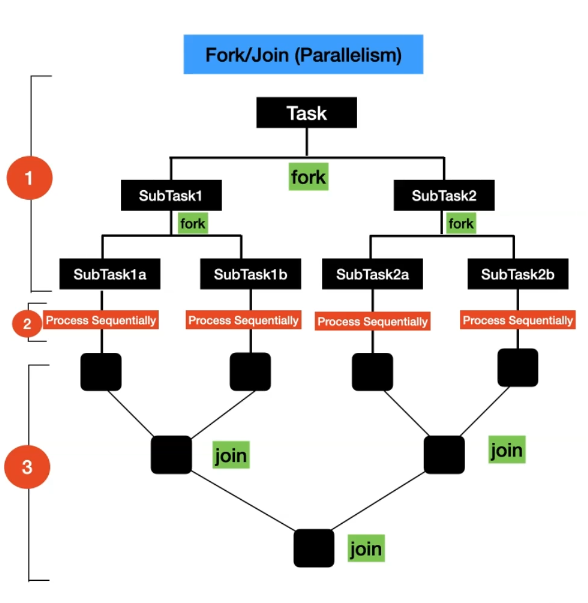
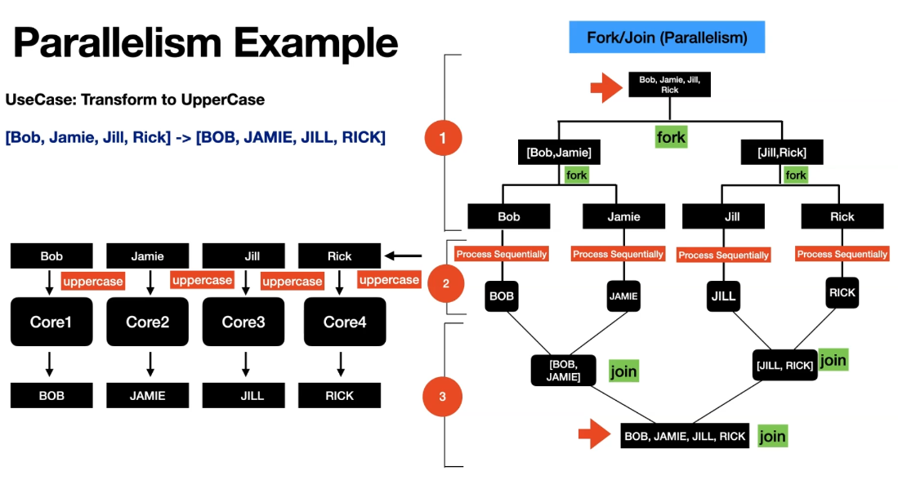
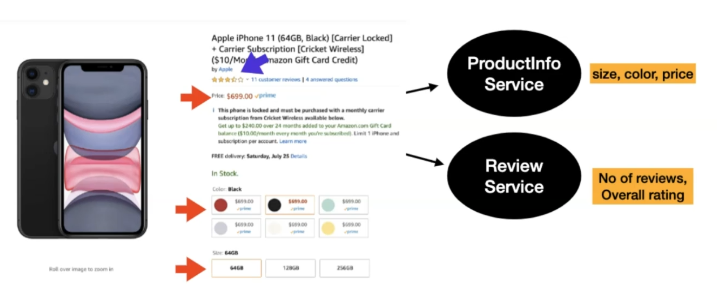
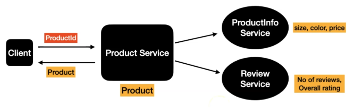
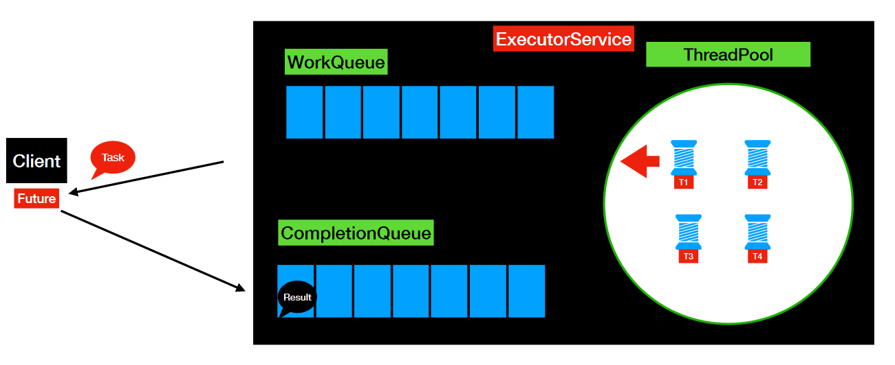
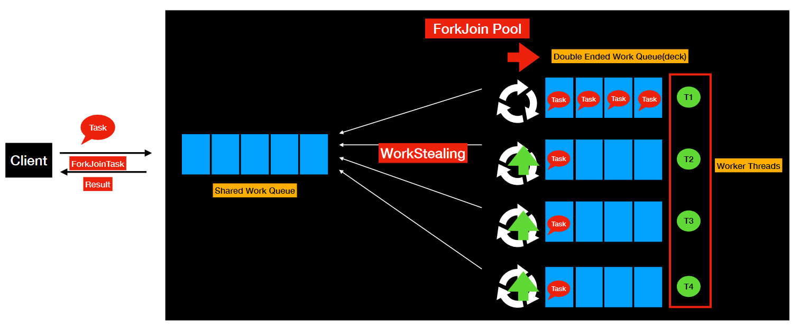
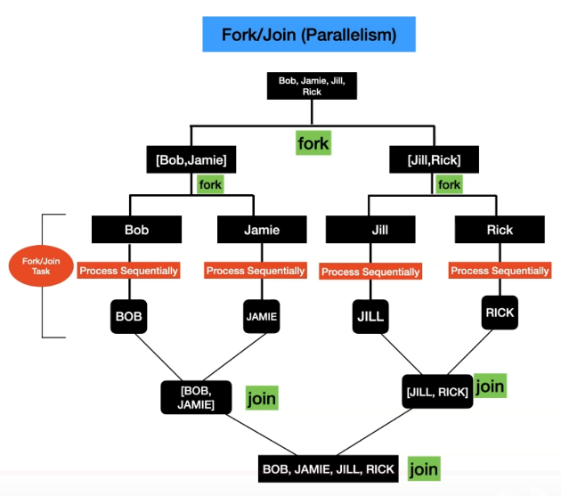
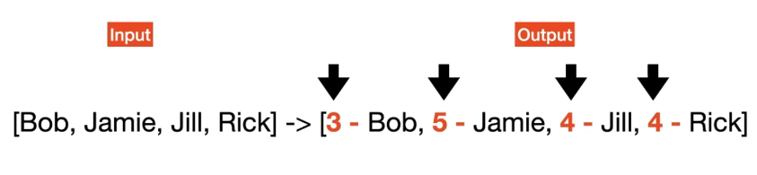
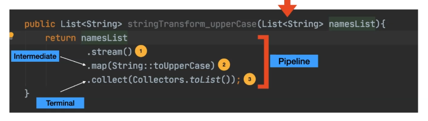

# Multithreading,Parallel & Asynchronous Coding in Modern Java
This repo has the code for parallel and asynchronous programming in Java.

# What is parallelism (vs. Concurrency) 




```java
public class ParallelismExample {
    public static void main(String[] args) {
        List<String> namesList = List.of("Bob", "Jamie", "Jill", "Rick");
        System.out.println("namesList : " + namesList);
        List<String> namesListUpperCase = namesList
                .parallelStream()
                .map(String::toUpperCase)
                .collect(Collectors.toList());

        System.out.println("namesListUpperCase : " + namesListUpperCase);
    }
}
```
# Threads, Future, ForkJoin and its Limitations






## Threads and its Limitations - Hands On

We need a lot of boilerplate code to achive parallelism here. We have to always implement the `Runnable` interface and pass its instances each into a seperate `Thread`.
```java
...

public Product retrieveProductDetails(String productId) throws InterruptedException {
    stopWatch.start();

    ProductInfoRunnable productInfoRunnable = new ProductInfoRunnable(productId);
    Thread productInfoThread = new Thread(productInfoRunnable);

    ReviewRunnable reviewRunnable = new ReviewRunnable(productId);
    Thread reviewThread = new Thread(reviewRunnable);

    productInfoThread.start();
    reviewThread.start();

    productInfoThread.join();
    reviewThread.join();

    ProductInfo productInfo = productInfoRunnable.getProductInfo();
    Review review = reviewRunnable.getReview();

    stopWatch.stop();
    log("Total Time Taken : "+ stopWatch.getTime());
    return new Product(productId, productInfo, review);
}

...

private class ProductInfoRunnable implements Runnable {
    private ProductInfo productInfo;
    private String productId;

    public ProductInfoRunnable(String productId) {
        this.productId = productId;
    }

    @Override
    public void run() {
        productInfo = productInfoService.retrieveProductInfo(productId);
    }

    public ProductInfo getProductInfo() {
        return productInfo;
    }
}

private class ReviewRunnable implements Runnable {
    private String productId;
    private Review review;

    public ReviewRunnable(String productId) {
        this.productId = productId;
    }

    @Override
    public void run() {
        review = reviewService.retrieveReviews(productId);
    }

    public Review getReview() {
        return review;
    }
}

...
```
Then it's needed to manually:
- create the threads
- start the threads
- join the threads

Next thing is, threads are expensive
- threads have their own *runtime-stack*, *memory*, *registers* and ...

the answer...

## Introduction to ThreadPool/ExecutorService & Future
### ThreadPool
- Thread Pool is a group of threads created and readily available
- CPU Intensive Tasks
    - ThreadPool Size = No of Cores
- I/O task
    - ThreadPool Size > No of Cores
- What are the benefits of thread pool?
    - No need to manually create, start and join the threads
    - Achieving Concurrency in your application

### ExecutorService
- Released as part of Java5
- ExecutorService in Java is an ***Asynchronous Task Execution Engine***
- It provides a way to asynchronously execute tasks and provides the results in a much simpler way compared to threads
- This enabled *coarse-grained task based parallelism* in Java



```java
ExecutorService executorService = Executors.newFixedThreadPool(Runtime.getRuntime().availableProcessors());
```
With the use of ExecutorService and Futures we can reduce boiler plate dramatically
```java
Future<ProductInfo> productInfoFuture = executorService.submit(() -> productInfoService.retrieveProductInfo(productId));
Future<Review> reviewFuture = executorService.submit(() -> reviewService.retrieveReviews(productId));

ProductInfo productInfo = productInfoFuture.get();
Review review = reviewFuture.get();
```
Execution can even be time boxed:
```java
ProductInfo productInfo = productInfoFuture.get(1, TimeUnit.SECONDS);
```
***
ExecutorService must be shut down!
***
drawbacks:
- **Future** is designed to lead to blocking (get)

## Fork-Join Framework
- This got introduced as part of Java7
- This is an extension of **ExecutorService**
- Fork/Join framework is designed to achieve ***Data Parallelism***
- ExecutorService is designed to achieve ***Task Based Parallelism***

### Fork Join Pool

At first T1 is getting the task and splits it into subtasks.
With **Workstealing** every thread in the work queue is looking to 'steal' tasks from other tasks so that the amount of work is spread almost equally.

### Fork Join Task


- ForkJoin Task represents part of the data and its computation
- Type of tasks to submit to ForkJoin Pool
    - ForkJoinTask
        - RecursiveTask -> Task that returns a value
        - RecursiveAction -> Task that does not return a value

### ForkJoin - Use Case


**drawbacks**: code might become relatively complex.

# Getting started with Parallel Streams
Streams in general:  


To work with parallel streams we just replace the `stream` call with `parallelStream` and thats it!1!!
but wait... let's get closer...

- Streams API are sequential by default
    - sequential() -> Executes the stream in sequential
    - parallel() -> Executes the stream in parallel
    - Both the functions() changes the behavior of the whole pipeline

changing the `parallelStream()` behaviour to sequential:
```java
List<String> stringTransform(List<String> inputs) {
    return inputs.parallelStream()
            .map(ParallelStreamsExample::addNameLengthTransform)
            .sequential()
            .collect(Collectors.toList());
}
```
the other way around:
```java
List<String> stringTransform(List<String> inputs) {
    return inputs.stream()
            .map(ParallelStreamsExample::addNameLengthTransform)
            .parallel()
            .collect(Collectors.toList());
}
```
